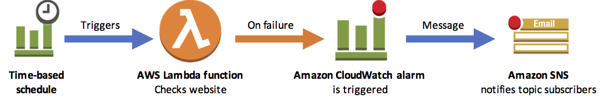

The event driven architecture on where Lambda to check a website for a specific text . If the check results a failure ,another Cloudwatch alarm is activated which calls to an Amazon SNS Topic which send notifications on all stakeholders such as Developers , Administartors & DevOps folks .

